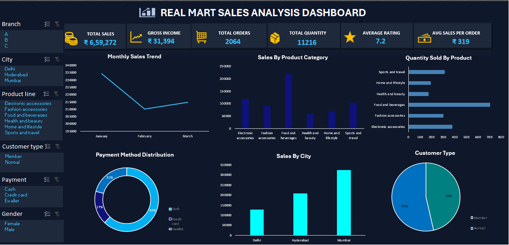

# Real Mart Sales Analysis – Excel Dashboard

## 📊 Project Overview

This project presents an interactive Excel dashboard created to analyze
sales performance, customer behavior, product performance, and payment methods
for Real Mart.

## 🛠️ Tools Used

- Microsoft Excel
- Pivot Tables
- Pivot Charts
- Slicers
- Excel Functions
- Data Cleaning
- Data Analysis

## 📌 Key KPIs

- Total Sales: ₹6,59,272
- Gross Income: ₹31,394
- Total Orders: 2,064
- Total Quantity: 11,216
- Average Rating: 7.2
- Average Sales per Order: ₹319

## 📈 Dashboard Analysis

The dashboard provides insights into:

- Monthly Sales Trend
- Sales by Product Category
- Quantity Sold by Product
- Payment Method Distribution
- Sales by City
- Customer Type Distribution
- Branch Analysis
- Gender Analysis

## 🎯 Key Insights

- Mumbai generated the highest sales among the three cities.
- Food and beverages contributed the highest sales among product categories.
- Cash was the most commonly used payment method.
- Normal customers represented a slightly larger share than members.
- The dashboard allows users to interactively filter the analysis using slicers.

## 📷 Dashboard Preview

